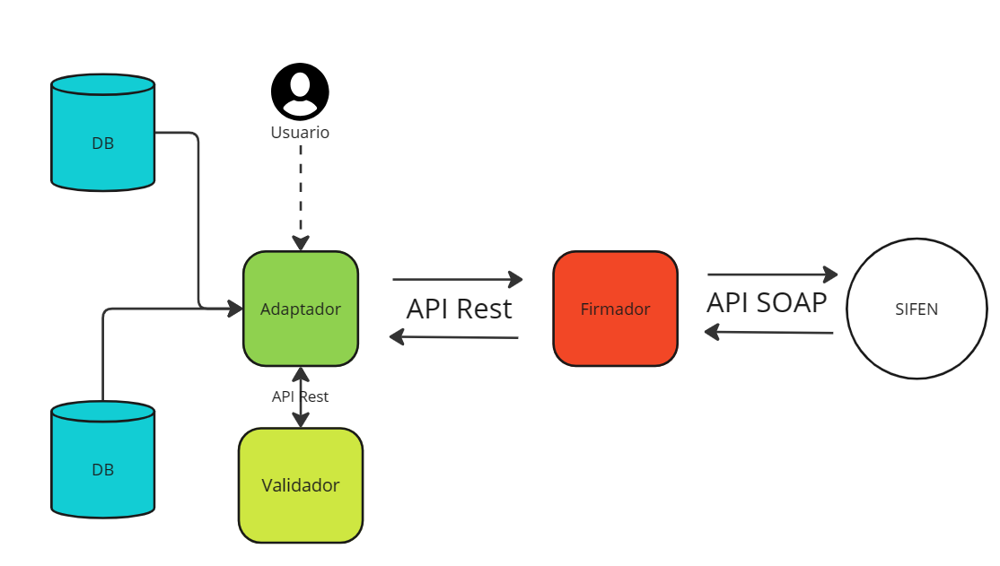

# FacturacionElectronicaPy.Net

## Descripción
Este proyecto pretende ser una solución de facturación electrónica completa, desde la firma de los documentos hasta el envío de estos a la SIFEN.

## Descripción gráfica

## Tecnologías
- Punto Net 8
- C#
- SQL Server
- Entity Framework
- Blazor

## Reglas y principios
- Se debe seguir el principio de responsabilidad única.
- Se debe seguir el principio de inversión de dependencias.
- Se debe seguir el principio de segregación de interfaces.
- Se debe seguir el principio de sustitución de Liskov.
- Se debe seguir el principio de abierto/cerrado.
- En resumen, se debe seguir el principio SOLID.
- Todo debe tener un test unitario.

## Objetivos
Tener una solución funcional que sirva de referencia y ayuda para la implementación de la facturación electrónica en Paraguay.

## Algunos cambios